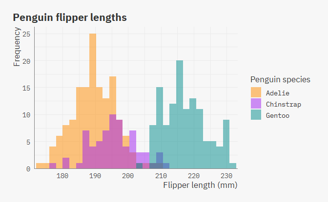

I've been busy and haven't been able to code in R for around 3 weeks now, and as my first project back, I decided to do something I've been wanting/planning to do for a while now: make a personal R package.

#### Background

Originally, I had intended to create a themes package called `ibthemes` for myself to speed up my plotting process both when doing EDA (viewing plots in the plots pane) and creating visualizations that I'll be saving. While writing the functions I instead decided to rename the package to `ib` and change its purpose from a plotting package to a general package containng functions for my personal use, since I realized I'll probably be creating more non-`ggplot2` functions at some point in time and would want them all in one place.

#### Functions

As of now, it only contains 6 functions, all for use when creating plots with `ggplot2`:

-   **`theme_ib`:** A simple `ggplot2` theme in my personal style. By default (`plots_pane = FALSE`), the theme adjusts the text sizes for printing images with width 10+ inches & height 8+ inches. `plots_pane = TRUE` is meant to be used when viewing plots in the plots pane and text sizes are not adjusted. There is also an option (`md = TRUE`) to use markdown theme elements from `ggtext` instead of [`element_text()`](https://ggplot2.tidyverse.org/reference/element.html). The fonts used are IBM Plex Sans & IBM Plex Mono, to load them you need `extrafont` and to run [`extrafont::loadfonts(device = "win", quiet = TRUE)`](https://rdrr.io/pkg/extrafont/man/loadfonts.html) if you're using Windows.

-   **`update_geom_fonts_ib`:** Update font defaults for text geoms to match `theme_ib`

-   **`scale_x_c_ib`:** Sets default values for the `expand` argument of `scale_x_continuous` that adds 0.5 units of space on both sides of the plot

-   **`scale_x_d_ib`:** Sets default values for the `expand` argument of `scale_x_discrete` that adds 0.5 units of space on both sides of the plot

-   **`scale_y_c_ib`:** Sets default values for the `expand` argument of `scale_y_continuous` such that there is no space below the lowest value and the top end of the plot is extended by 5% (eg. for use with bar plots)

-   **`scale_y_d_ib`:** Sets default values for the `expand` argument of `scale_y_discrete` such that there is no space below the lowest value and the top end of the plot is extended by 5% (eg. for use with bar plots)

#### Exmaples

The following plots were taken from [Allison Horst](https://twitter.com/allison_horst)'s `palmerpenguins` [README](https://github.com/allisonhorst/palmerpenguins/blob/master/README.md).

Using `theme_ib` to print a scatter plot with width = 12 inches & height = 8 inches and the `md = TRUE` argument to use [`ggtext::element_markdown()`](https://rdrr.io/pkg/ggtext/man/element_markdown.html) instead of [`element_text()`](https://ggplot2.tidyverse.org/reference/element.html) for text elements, in this case the subtitle:

    library(ggplot2)
    library(palmerpenguins)
    library(ib)
    extrafont::loadfonts(device = "win", quiet = TRUE) ## to load the font

    ggplot(data = penguins,
           aes(x = flipper_length_mm,
               y = bill_length_mm)) +
      geom_point(aes(color = species),
                 size = 3,
                 alpha = 0.8, show.legend = FALSE) +
      geom_smooth(method = "lm", se = FALSE, aes(color = species), show.legend = FALSE) +
      scale_color_manual(values = c("darkorange","purple","cyan4")) +
      labs(title = "Flipper and bill length",
           subtitle = "Dimensions for Adelie, Chinstrap and Gentoo Penguins at Palmer Station LTER",
           x = "Flipper length (mm)",
           y = "Bill length (mm)",
           color = "Penguin species") +
      theme_ib(md = TRUE) +
      ggsave("flipper_bill.png",device = "png", type = "cairo", width = 12, height = 8, dpi = 300)

``

Using the `plots_pane = TRUE` argument in `theme_ib`, and adjusting the scales using `scale_x_c_ib` & `scale_y_c_ib`:

    ggplot(data = penguins, aes(x = flipper_length_mm)) +
      geom_histogram(aes(fill = species), 
                     alpha = 0.5, 
                     position = "identity") +
      scale_fill_manual(values = c("darkorange","purple","cyan4")) +
      labs(title = "Penguin flipper lengths",
           x = "Flipper length (mm)",
           y = "Frequency",
           fill = "Penguin species") +
      theme_ib(plots_pane = TRUE) +
      scale_x_c_ib() +
      scale_y_c_ib()

<pre class='chroma'></pre>

